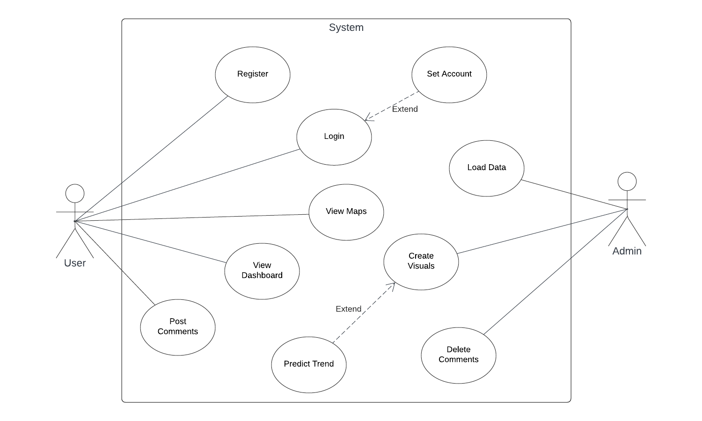

# IoT Air Quality Dashboard

## Description

This website will display historical air quality information for US cities from the year 2000 to 2021, through graphs. The website will track the pollutants Carbon Monoxide, Nitrogen Dioxide, Ozone, and Sulphur Dioxide (CO, NO2, O3, SO2). This will serve to inform the public about the increasing pollution in US cities and hopefully make them more aware of not only their impact but also of the collective impact of the industries they support. This information could also be shown to school children to make them aware of the rapidly changing world they inhabit and the potential threats that come with the status quo lifestyle of the US general population. 

- The stack that we used:
  - Flask and Django → web frameworks
  - SQLite → database
  - leaflet.js → maps
  - Twilio (free credits),
  - Contextual menu bar (account, map, contact us, analysis, pages)
  - Python
  - HTML

- Programming Language
  - Python
  - HTML, CSS
  - JavaScript

## Usage

Our website displays a map of the US, with pinpoints on major cities. Click on the cities to display a dashboard of graphs displaying the pollution data. Toggle the individual pollutants and adjust the time scale using the taskbar on the right.

## Credits

Our data was sourced from a dataset found on Kaggle, with the title US Pollution 2000-2021, by Angle Kim,
which was originally sourced from US EPA data: https://www.kaggle.com/datasets/alpacanonymous/us-pollution-20002021.

## 　User Requirements

- Only registered users can access the dashboard.
- Users can register by using username and password, they also need to put their city, state, country, name and email information.
- Users can modify their account information.
- Users can access the cleanest city and best-improvement cities
- Users can access maps with pollution visualization on it.
- Users can access graph visualization of the pollution.
- Users can see the historical dashboard by date.
- Users can comment on the graphs.
- Users can get notifications of the air pollution in their location.

## Functional Requirements

Main

- Rank top 10 cleanest to least clean cities
- Rank top 10 cities where air quality improves/worsened
- Show correlation with population and other external data
- Chart of each pollutant (CO, NO2, O3 and SO2)
- Time-series graph of pollution
- Calendar for users to switch between dates and see dashboards from different dates

US map with pinpoint of the place with pollution (map)  

Analysis page with graphs and a comment section (user post)

Login

- Login with username and password
- Forgot password/username

Account Setting

- Change username, password, and user information

Create a new account (username, password, user information)  

User Notification through email

- Users will get a notification about email verification
- Users will get a notification once every week for a small trivia regarding the pollution data

Feedback (contact us)

- Send a text message to the admin (username and comment)

## Non-Functional Requirements

- Performance: The dashboard should load quickly and respond to user interactions (such as filtering or updating data) without significant delay, even when handling large datasets.
- Security: The dashboard should implement appropriate security measures to protect sensitive data and prevent unauthorized access, ensuring confidentiality, integrity, and availability of information.
- Usability: The dashboard should have an intuitive and user-friendly interface, making it easy for users to navigate, understand the displayed information, and perform tasks effectively.
- Accessibility: The dashboard should be accessible to users with disabilities, conforming to accessibility standards to ensure all users can interact with the dashboard.

## Use Case Diagram

